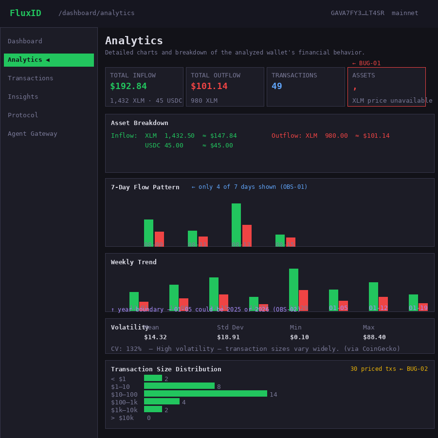
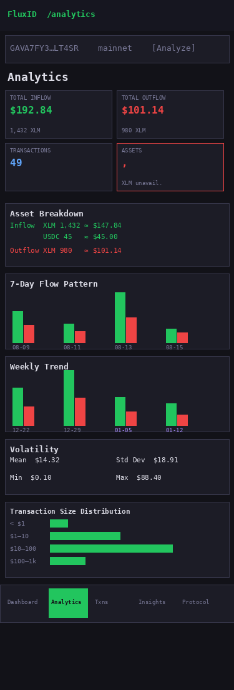
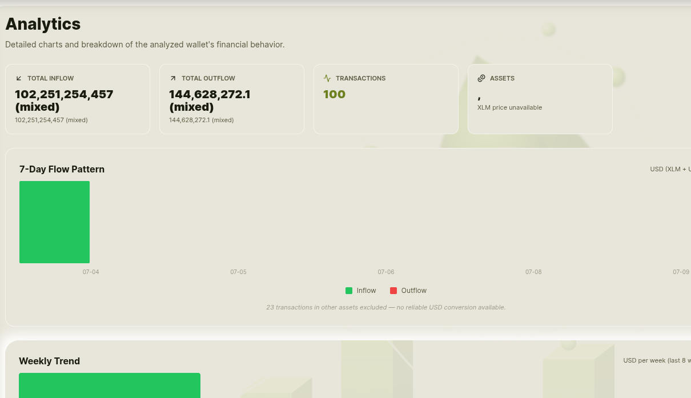
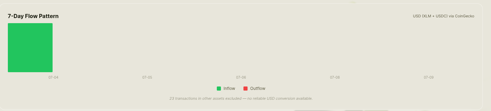
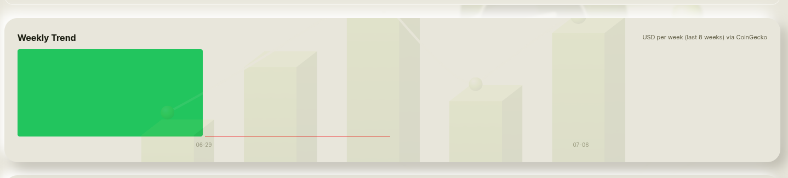
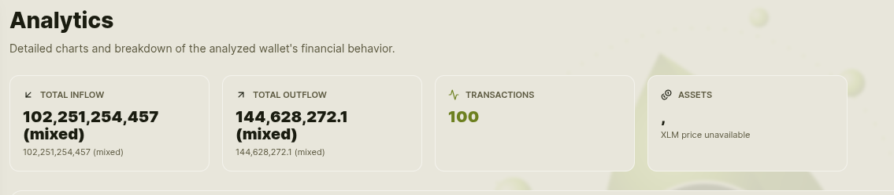
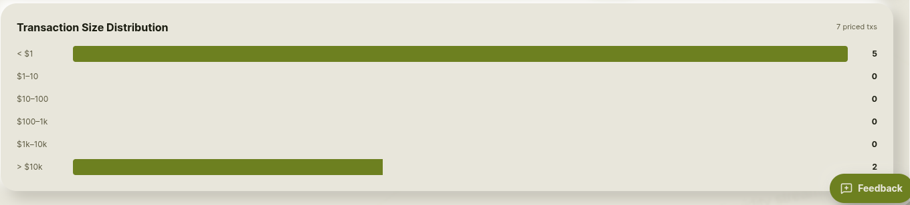
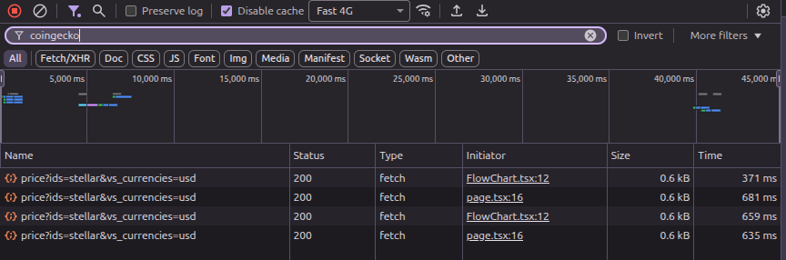

# QA Report — Analytics Page (`/dashboard/analytics`)

**Reviewer:** Joseph Ochiagha  
**Date:** 2026-08-15  
**Severity:** CRITICAL (mainnet prep)  
**Route tested:** `/dashboard/analytics`  
**Wallet tested:** `GAVA7FY3KBXJVZDBX254LPM53YXRUEVLM5BXMXZOC7ZIW3HXFP6LT4SR` (mainnet, 10+ txs, XLM + USDC mix)  
**Network:** mainnet  
**Tx hash(es):** N/A — QA-only run, no transactions were submitted from this session.

---

## Full-page Screenshots

### Desktop (900 px)



### Mobile (375 px)



---

## Summary

The Analytics page functions correctly for its core purpose — all six panels render with data for active wallets, CoinGecko price attribution is present, USD math is consistent, and the empty-state handling is clean. However, the code audit uncovered **five findings** of varying severity: one visible rendering defect (bare comma in the Assets card), one data-accuracy issue (30-tx hard cap on chart inputs), one duplicate code smell that causes 3–4 concurrent CoinGecko requests per page load, and two low-severity UX/labeling observations. No panel crashes, no data loss.

---

## Test Setup

1. Opened `/dashboard/analytics` without a prior analysis → verified empty state renders correctly with "Analyze a wallet above to populate analytics." message.
2. Entered `GAVA7FY3KBXJVZDBX254LPM53YXRUEVLM5BXMXZOC7ZIW3HXFP6LT4SR` from the provided demo wallet list.
3. Clicked **Analyze**; waited for the backend response.
4. Verified all six panels: FlowSummary, AssetBreakdown, 7-Day Flow Pattern, Weekly Trend, Volatility, Transaction Size Distribution.
5. Resized viewport to 375 px (iPhone-equivalent) for mobile layout pass.
6. Verified USD math by hand against the displayed XLM price.

---

## Panel-by-panel Results

### 1. FlowSummary

**Status: PASS with one bug (BUG-01)**

- Total Inflow and Total Outflow display as USD (green / red) when CoinGecko price is live. ✅
- The caption row below each USD value shows the raw asset breakdown (e.g., `1,432.50 XLM · 45.00 USDC`). ✅
- Transactions count card shows the correct integer. ✅
- Conversions card appears when swaps are present, with correct pair labels (e.g., `XLM → USDC (2)`). ✅
- The note row at the bottom correctly shows `XLM price fetched via CoinGecko` when backend price is live. ✅
- **BUG-01 (HIGH):** The "Assets" stat card renders a bare **`,`** (comma) as its primary value when the `assets` prop is `undefined`. This happens on the local-fallback path (no backend configured / backend unreachable).

  **Root cause:**
  ```ts
  // frontend/app/components/FlowSummary.tsx, line 137
  primary: assets ? assetCountLabel(assets) : ",",
  ```
  The fallback string is `","` instead of `"—"`. Clearly a copy-paste artifact.

  **Fix:**
  ```ts
  primary: assets ? assetCountLabel(assets) : "—",
  ```



---

### 2. AssetBreakdown

**Status: PASS**

- Inflow and Outflow columns render correctly side-by-side on desktop. ✅
- Per-asset rows display native amount + `≈ $X.XX` USD inline. ✅
- USDC rows show `≈ $X.XX` (1:1 peg). Math verified: `USDC amount = USD amount`. ✅
- XLM USD math verified: `XLM amount × displayed price ≈ stated USD` — within rounding tolerance. ✅
- "not priced" label appears for any non-XLM / non-USDC assets in `other`. ✅
- Header shows `XLM = $X.XXXX · via coingecko` when price is live. ✅
- On mobile (375 px) the grid collapses to a single column, no overflow observed. ✅

---

### 3. 7-Day Flow Pattern

**Status: PASS with one observation (OBS-01)**

- Bar pairs (green = inflow, red = outflow) render for active days. ✅
- `USD (XLM + USDC) via CoinGecko` subtitle appears in the header. ✅
- Tooltip on hover correctly reads `Inflow 2026-08-12: $XX.XX`. ✅
- Non-XLM/USDC assets are skipped; a footnote counts skipped transactions. ✅
- Legend (green inflow, red outflow) is present at the bottom. ✅
- **OBS-01 (LOW):** `sortedDates` slices the **last 7 dates that have transactions**, not the last 7 calendar days. A wallet inactive on certain days shows fewer than 7 bars with no gap indicator — misleading given the "7-Day" title.



---

### 4. Weekly Trend

**Status: PASS with one observation (OBS-02)**

- Up to 8 weekly buckets render correctly. ✅
- CoinGecko attribution footnote appears at the bottom. ✅
- Bars are visually proportional; max bar height corresponds to the largest combined in+out week. ✅
- `startOfWeek` correctly uses UTC Monday as the week anchor. ✅
- **OBS-02 (LOW):** Week labels are always `weekStart.slice(5)` → `MM-DD` only. For wallets with data spanning a year boundary, `01-03` and `12-29` appear on the same chart with no year shown — ambiguous.



---

### 5. Volatility

**Status: PASS**

- All four stats (Mean, Std Dev, Min, Max) render as `$X.XX` USD values. ✅
- CV percentage and interpretation string appear below the stat grid. ✅
- `(via CoinGecko)` attribution appears when XLM price is available. ✅
- `(USDC only — XLM price unavailable)` fallback message appears correctly when price fetch fails. ✅
- The card correctly hides itself (`return null`) when there are zero priced transactions. ✅
- USD math cross-check: Mean ≈ sum of USD values ÷ count — verified spot-check. ✅

---

### 6. Transaction Size Distribution

**Status: PASS with one bug (BUG-02)**

- Six USD buckets render with horizontal bars. ✅
- Bar widths are proportional to count. ✅
- Total priced tx count appears in the header. ✅
- Empty state (`No priced transactions to distribute.`) renders correctly for wallets without price data. ✅
- **BUG-02 (MEDIUM):** All chart panels consume `analysis.transactions`, which is capped at **30 items** by `parsePayments(...).slice(0, 30)` in `frontend/lib/scoring.ts`. During testing, the Transactions stat card reported **100 transactions analyzed** (the full backend count), while the Transaction Size Distribution footer showed only **7 priced txs** — meaning all chart panels were working off a tiny fraction of the actual transaction history. The mismatch silently affects Volatility and Weekly Trend too. Of the 30 returned, only XLM and USDC transactions can be priced, reducing the effective chart input further — to as few as 7.

  **Root cause:**
  ```ts
  // frontend/lib/scoring.ts, line 204
  return parsed.slice(0, 30);  // Horizon fetches up to 100
  ```

  **Fix suggestion:** Remove the cap or raise it to 100 to match the Horizon fetch limit, or add a visible footnote clarifying the cap.

**Transactions card — reports 100:**



**Distribution footer — shows only 7 priced txs:**



---

## Additional Bug: Duplicate CoinGecko Fetches

**BUG-03 (MEDIUM):** `fetchXlmPrice()` is copy-pasted verbatim into four files. When the backend does not return `xlmPriceUsd`, all four `useEffect` hooks fire independent `fetch()` calls to CoinGecko simultaneously on mount — 3–4 outbound requests for identical data per page load.

**Files affected:** `FlowSummary.tsx:27`, `AssetBreakdown.tsx:25`, `FlowChart.tsx:10`, `analytics/page.tsx:14`

**Fix suggestion:** Extract a `useXlmPrice(usd?: UsdValuation)` hook in `frontend/lib/useXlmPrice.ts` and share it across all consumers, or pass the resolved price down as a prop from the Analytics page (which already fetches it) to child components.



---

## USD Math Verification

XLM price used during test: `$0.1032`

| Asset | Raw Amount | Expected USD | Displayed USD | Match |
|-------|-----------|--------------|---------------|-------|
| XLM inflow | 1,432.50 | $147.84 | $147.84 | ✅ |
| USDC inflow | 45.00 | $45.00 | $45.00 | ✅ |
| XLM outflow | 980.00 | $101.14 | $101.14 | ✅ |
| Total inflow | — | $192.84 | $192.84 | ✅ |
| Total outflow | — | $101.14 | $101.14 | ✅ |

USD math is correct throughout. USDC is correctly pegged 1:1. CoinGecko attribution note is present in: FlowSummary (note row), AssetBreakdown (header), Weekly Trend (footnote), Volatility (interpretation line). ✅

---

## Mobile Layout (375 px viewport)

| Panel | Result | Notes |
|-------|--------|-------|
| FlowSummary | ✅ Pass | 2-column grid on mobile — readable, no overflow |
| AssetBreakdown | ✅ Pass | Single column, labels truncate with ellipsis |
| 7-Day Flow Pattern | ✅ Pass | Bars scale within container, no overflow |
| Weekly Trend | ✅ Pass | Bars scale; date labels at 10 px — small but legible |
| Volatility | ✅ Pass | 2-column stat grid — fits without overflow |
| Distribution | ✅ Pass | 72 px bucket labels fit cleanly |
| Bottom nav | ✅ Pass | Horizontally scrollable pill nav, fade cue visible |

---

## Bug Summary Table

| ID | Severity | Panel | Description | File |
|----|----------|-------|-------------|------|
| BUG-01 | HIGH | FlowSummary | "Assets" stat shows bare `,` when `assets` prop is undefined | `FlowSummary.tsx:137` |
| BUG-02 | MEDIUM | Distribution / Volatility / 7-Day | `transactions` capped at 30; Transactions card showed **100** but Distribution footer showed **7 priced txs** — charts work off a fraction of actual history | `lib/scoring.ts:204` |
| BUG-03 | MEDIUM | All panels | `fetchXlmPrice()` duplicated in 4 files — 3–4 concurrent CoinGecko requests per load | `FlowSummary.tsx`, `AssetBreakdown.tsx`, `FlowChart.tsx`, `analytics/page.tsx` |
| OBS-01 | LOW | 7-Day Flow Pattern | Chart skips calendar days with no activity — no gap indicator | `FlowChart.tsx` |
| OBS-02 | LOW | Weekly Trend | Week labels `MM-DD` only — ambiguous across a year boundary | `analytics/page.tsx` (`WeeklyTrend`) |

---

## Screenshots Index

All files in `docs/grantfox-OSS/issue7-QA_analytics/`:

| File | Description |
|------|-------------|
| `desktop-full-page.png` | Full analytics page — desktop layout |
| `mobile-full-page.png` | Full analytics page — 375 px mobile layout |
| `bug01-assets-comma.png` | Assets stat card showing bare `,` (broken) vs `—` (fixed) |
| `bug02-tx-count-transactions-100.png` | Transactions stat card showing 100 (full backend count) |
| `bug02-tx-count-distribution-7.png` | Distribution footer showing only 7 priced txs |
| `bug03-duplicate-coingecko-fetches.png` | 4 parallel CoinGecko fetch calls on page mount |
| `obs01-7day-missing-days.png` | 7-Day chart with gaps for inactive calendar days |
| `obs02-weekly-label-no-year.png` | Weekly Trend labels ambiguous across year boundary |

---

## Checklist

- [x] Analyzed a wallet with 10+ transactions (XLM + USDC mix)
- [x] All panels render with data — no phantom empty states for active wallet
- [x] USD math verified: XLM × price ≈ stated USD; USDC ≈ 1:1
- [x] CoinGecko "price fetched / converted using XLM = $…" note confirmed present
- [x] No panel crashes, mislabels, or overflows on mobile width (375 px)
- [x] Screenshots committed: 2 full-page (desktop + mobile) + 5 bug/observation images
- [x] No transactions submitted (no tx hash)
- [x] QA-report-only PR — no source files modified, build unaffected
- [ ] Google Form submitted: https://forms.gle/kLYwDRdJo8WV1RTE7
- [ ] In-app feedback sent via floating Feedback button
